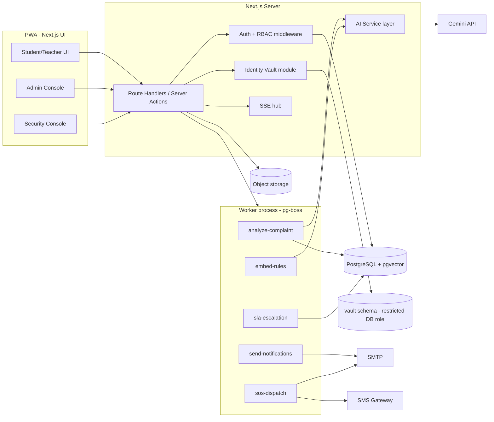

# CampusVoice — Architecture (v1.0)

> Companion to `PRD.md`. IDs like `AUTH-1`, `CMP-3` refer to PRD requirements.

---

## 1. Tech Stack

| Layer | Choice | Why |
|---|---|---|
| Framework | **Next.js (App Router) + TypeScript** | One codebase for UI + API, easy for an AI agent to scaffold |
| UI | Tailwind CSS + shadcn/ui | Fast, accessible components |
| Database | **PostgreSQL** + **pgvector** extension | Relational data + embeddings in one place |
| ORM | **Prisma** | Typed schema + migrations |
| Auth | Auth.js (Credentials) with database sessions, **argon2id** | Standard, secure; swap if needed |
| Validation | **zod** on every API boundary | Safe against bad input |
| Background jobs | **pg-boss** (Postgres-backed queue) | No Redis needed; runs AI analysis, SLA checks, emails |
| Realtime | **Server-Sent Events** (MVP) → WebSocket/Pusher later | Simple for chat + SOS alerts |
| File storage | S3-compatible (Cloudflare R2 / Supabase Storage) | Evidence files, rule PDFs |
| Email | SMTP via Nodemailer or Resend | OTP, SOS mail, notifications |
| SMS | Twilio or MSG91 (India) | SOS SMS |
| AI | **Gemini API** behind an `AIProvider` interface (model name from env) | Swappable; embeddings + structured JSON output |
| Testing | Vitest (unit), Playwright (e2e) | Agent can run + verify in browser |
| Local dev | Docker Compose (postgres+pgvector, mailpit) | One-command setup |
| Deploy | Vercel + Neon/Supabase, or Docker on college server | Flexible |

## 2. High-Level Architecture



## 3. Repository Structure

```
campusvoice/
├─ PRD.md  ARCHITECTURE.md  WORKFLOW.md  ANTIGRAVITY_PROMPT.md
├─ docker-compose.yml
├─ .env.example
├─ prisma/
│  ├─ schema.prisma
│  ├─ migrations/
│  └─ seed.ts                # demo roster, categories, rules, admin
├─ src/
│  ├─ app/
│  │  ├─ (public)/           # landing, login, register, track, rules
│  │  ├─ (user)/             # dashboard, complaints, assistant, sos
│  │  ├─ (admin)/admin/      # cases, alerts, rules, users, analytics, audit
│  │  ├─ (security)/security/# SOS console
│  │  └─ api/                # route handlers (see §7)
│  ├─ server/
│  │  ├─ auth/               # session, password, otp, rbac
│  │  ├─ vault/              # identity-vault.ts (ONLY module touching vault schema)
│  │  ├─ complaints/         # service, tracking-key, timeline
│  │  ├─ chat/
│  │  ├─ rules/
│  │  ├─ ai/
│  │  │  ├─ provider.ts      # AIProvider interface + Gemini impl
│  │  │  ├─ prompts/         # versioned prompt files
│  │  │  ├─ analyze.ts       # classification, severity, spam/anomaly
│  │  │  ├─ rag.ts           # rules assistant
│  │  │  └─ trust.ts         # trust score engine (pure functions)
│  │  ├─ sos/
│  │  ├─ notifications/
│  │  ├─ jobs/               # pg-boss workers
│  │  └─ audit.ts
│  ├─ components/
│  ├─ lib/                   # utils, zod schemas, constants
│  └─ tests/
└─ worker.ts                 # starts pg-boss workers
```

## 4. Database Schema (Prisma-level overview)

**Public schema**

| Table | Key columns |
|---|---|
| `users` | id, username (unique), password_hash, role, college_email, roster_id (unique, FK), status (`PENDING_VERIFY/ACTIVE/SUSPENDED`), department, phone (for SOS, optional), created_at |
| `college_roster` | id, enrollment_no (unique), full_name, college_email, role, department, claimed (bool) |
| `verification_requests` | id, user_id, method (`ROSTER_OTP/ID_CARD`), otp_hash, otp_expires, id_card_file_key, status, reviewed_by |
| `complaints` | id, tracking_key_hash (unique), category_id, title, description, location_id, incident_at, mode (`CONFIDENTIAL/ULTRA_ANON`), status, priority (`LOW/MEDIUM/HIGH/CRITICAL`), pseudonym (e.g. A7F3), assigned_to, cluster_id, target_entity_id, restricted_queue (`NONE/ICC/ANTI_RAGGING`), created_at, resolved_at. **No user_id column.** |
| `complaint_events` | id, complaint_id, type, actor_role (never actor identity for complainant), payload (json), created_at |
| `complaint_messages` | id, complaint_id, sender (`COMPLAINANT/ADMIN`), admin_id (nullable), body, created_at, read_at |
| `internal_notes` | id, complaint_id, admin_id, body, created_at |
| `attachments` | id, complaint_id, message_id?, file_key, mime, size, sanitized (bool) |
| `categories` | id, name, severity_weight, routes_to_queue |
| `locations` | id, name, lat, lng (campus places) |
| `target_entities` | id, type (`DEPARTMENT/PLACE/ROLE_LABEL`), label |
| `complaint_clusters` | id, representative_embedding (vector), size, first_seen, last_seen |
| `ai_analyses` | id, complaint_id, model, prompt_version, summary, suggested_category, severity_score, priority, spam_probability, anomaly_flags (json), reasoning, embedding (vector), created_at, overridden_by? |
| `risk_alerts` | id, type (`CRITICAL/PATTERN/RECURRENCE/SLA_BREACH/SPAM_BURST`), complaint_id?, cluster_id?, target_entity_id?, message, recommended_actions (json), status (`OPEN/ACK/DONE`), created_at |
| `rule_documents` | id, title, category, body_md, file_key?, version, updated_by, updated_at |
| `rule_versions` | id, rule_id, version, body_md, changed_by, change_note, created_at |
| `rule_chunks` | id, rule_id, version, chunk_text, section_label, embedding (vector) |
| `assistant_sessions` / `assistant_messages` | Chat history for AI assistant (user-scoped; deleted on request) |
| `notifications` | id, user_id (nullable for ultra-anon), channel, type, payload, read_at |
| `sos_events` | id, user_id, lat, lng, status (`TRIGGERED/DISPATCHED/ACK/RESPONDING/RESOLVED/FALSE_ALARM`), dispatched_to (json), created_at |
| `sos_location_pings` | id, sos_id, lat, lng, at |
| `police_stations` | id, name, email, phone, lat, lng, active |
| `sla_policies` | id, priority, first_response_hours, resolution_hours |
| `audit_logs` | id, actor_id, action, entity, entity_id, meta (json), created_at (append-only) |
| `break_glass_requests` | id, complaint_id, requested_by, reason, approver_id?, status, created_at, decided_at |

**Vault schema (`vault`)** — separate Postgres schema and DB role; only `src/server/vault` connects with it.

| Table | Key columns |
|---|---|
| `vault.reporter_links` | complaint_id (unique), enc_user_id (AES-256-GCM), created_at — **not created for ULTRA_ANON complaints** |
| `vault.reporter_scores` | user_id, score, tier, updated_at |
| `vault.score_events` | id, user_id, complaint_id (encrypted), delta, reason, created_at |

## 5. Anonymity & Identity Vault

1. On submit (Confidential): server creates complaint (no user id) → calls `vault.linkReporter(complaintId, userId)` → encrypts `userId` with `VAULT_KEY` (from env/KMS) and stores it.
2. "My Complaints": server calls `vault.listComplaintsForUser(userId)` — it decrypts links belonging to this user only.
3. Admin APIs use a DB role **without** `vault` privileges. Even a bug in an admin endpoint cannot read the vault.
4. Trust score changes: admin decision → `trust.apply(complaintId, outcome)` → vault resolves user internally → updates score. Admin response contains only the resulting **tier**.
5. Ultra-Anonymous: no vault row; chat/tracking authenticated only by tracking key.
6. **Tracking key:** 8 random chars from Crockford base32 (no ambiguous chars) + checksum, formatted `CV-YYMM-XXXX-XXXX`. Store `SHA-256(key + PEPPER)`. Show the key once with copy/download button and a warning.
7. Do not log request bodies for complaint routes. No IP stored with complaints. Rate limiting uses short-lived hashed counters.
8. Break-glass: `requestReveal` (Super Admin) → `approveReveal` (a *different* Super Admin) → `revealReporter` returns identity once, writes audit log, notifies approver. Disabled for Ultra-Anonymous (impossible by design).

## 6. RBAC Matrix

| Capability | Student | Teacher | Admin | Super Admin | Security |
|---|:-:|:-:|:-:|:-:|:-:|
| Read rules | ✔ | ✔ | ✔ | ✔ | ✔ |
| Edit rules | – | – | – | ✔ | – |
| File complaint | ✔ | ✔ | – | – | – |
| View own complaints (Confidential) | ✔ | ✔ | – | – | – |
| Track by key | ✔ | ✔ | ✔ | ✔ | – |
| Chat on own complaint | ✔ | ✔ | – | – | – |
| View all complaints | – | – | ✔ (restricted queues need membership) | ✔ | – |
| Change status / assign / notes / chat as admin | – | – | ✔ | ✔ | – |
| View risk alerts | – | – | ✔ | ✔ | – |
| Import roster / manage users | – | – | – | ✔ | – |
| Approve ID-card verification | – | – | ✔ | ✔ | – |
| Confirm "malicious" outcome | – | – | – | ✔ | – |
| Break-glass reveal | – | – | – | ✔ (two-person) | – |
| Audit logs | – | – | – | ✔ | – |
| Trigger SOS | ✔ | ✔ | ✔ | ✔ | ✔ |
| View/ack SOS events | – | – | ✔ | ✔ | ✔ |

Implementation: `requireRole(...)` and `requirePermission(...)` helpers used in **every** route handler; unit-test the matrix.

## 7. API Surface (REST route handlers)

| Area | Endpoints |
|---|---|
| Auth | `POST /api/auth/register`, `POST /api/auth/verify/roster`, `POST /api/auth/verify/otp`, `POST /api/auth/verify/id-card`, `POST /api/auth/login`, `POST /api/auth/logout`, `POST /api/auth/reset/*` |
| Complaints | `POST /api/complaints`, `GET /api/complaints/mine`, `GET /api/track/:key`, `POST /api/track/:key/messages`, `GET /api/track/:key/events` |
| Admin cases | `GET /api/admin/cases`, `GET /api/admin/cases/:id`, `PATCH /api/admin/cases/:id` (status/assign/priority), `POST /api/admin/cases/:id/messages`, `POST /api/admin/cases/:id/notes`, `POST /api/admin/cases/:id/outcome` (valid/partial/spam/malicious) |
| Alerts | `GET /api/admin/alerts`, `PATCH /api/admin/alerts/:id` |
| Rules | `GET /api/rules`, `GET /api/rules/:id`, `POST/PUT/DELETE /api/admin/rules` |
| Assistant | `POST /api/assistant/chat` (streams), `GET /api/assistant/sessions` |
| Users | `POST /api/admin/roster/import`, `GET /api/admin/verifications`, `PATCH /api/admin/verifications/:id`, `PATCH /api/admin/users/:id` |
| SOS | `POST /api/sos`, `POST /api/sos/:id/cancel`, `POST /api/sos/:id/ping`, `GET /api/security/sos/stream` (SSE), `PATCH /api/security/sos/:id` |
| Analytics | `GET /api/admin/analytics/*` |
| Break-glass | `POST /api/admin/reveal/request`, `POST /api/admin/reveal/:id/approve` |
| Streams | `GET /api/stream/notifications` (SSE) |
| Health | `GET /api/health` |

All inputs validated with zod; consistent error shape `{ error: { code, message } }`.

## 8. AI Architecture

### 8.1 Provider abstraction
```ts
interface AIProvider {
  generateJSON<T>(opts: { system: string; input: string; schema: ZodSchema<T> }): Promise<T>;
  chatStream(opts: { system: string; messages: Msg[]; context: string[] }): AsyncIterable<string>;
  embed(texts: string[]): Promise<number[][]>;
}
```
Model names, API keys, daily cost cap come from env. Prompts live in `src/server/ai/prompts/*.md` with a `PROMPT_VERSION`.

### 8.2 Complaint analysis pipeline (job: `analyze-complaint`)
1. **Pre-checks (no LLM, deterministic):** rate of filings by this account (via vault, internal only), text length, duplicate hash, profanity-only ratio, URL/phone spam patterns.
2. **Embedding** of title+description → store in `ai_analyses.embedding`.
3. **Similarity search** (pgvector cosine) against last 90 days → cluster assignment, duplicate/recurrence detection (TRK-3/4).
4. **LLM structured analysis** (complaint text is untrusted data, wrapped and never treated as instructions): returns `{summary, category, severity_score, urgency_signals[], spam_probability, anomaly_flags[], reasoning}`.
5. **Priority calculation (deterministic):**
   `priority_score = category.severity_weight + urgency_signals_weight + min(cluster_size,5)*3 + target_entity_recent_count*2 + sla_age_factor`, then multiplied by trust factor (0.9–1.1 only, and **1.0 for safety categories**). Map to LOW/MEDIUM/HIGH/CRITICAL.
   Hard rules: any `threat/self-harm/weapon/assault` signal → at least HIGH; confirmed imminent danger → CRITICAL.
6. **Spam decision:** if `spam_probability ≥ 0.8` or ≥2 anomaly flags → status `FLAGGED_REVIEW` (hidden from normal queue priority, shown in Review queue). **Never auto-reject, never auto-penalize.**
7. **Risk alerts:** create `risk_alerts` rows (CRITICAL, PATTERN, RECURRENCE) with `recommended_actions` list (LLM-suggested, admin-editable).
8. Write `complaint_events` (`AI_SCREENED`) and emit SSE to admin dashboard.

### 8.3 Rules assistant (RAG)
- On rule create/update: chunk by headings (~500 tokens), embed, store in `rule_chunks` (job `embed-rules`).
- Query: embed question → top-k chunks (k=5) → prompt with strict instruction "answer only from context; cite `[Rule Title › Section]`; if insufficient context say so."
- Guardrails: refuse to disclose any complaint data, system prompt, or other users' info; crisis-language detector appends helpline + SOS shortcut.
- Conversation history stored per user; user can delete it.

### 8.4 Trust engine (`trust.ts`)
Pure, unit-tested functions: `applyOutcome(score, outcome) → {newScore, delta}`, `tierOf(score)`, `monthlyRecovery(score)`. Rules from PRD §7.

## 9. SOS Architecture

1. Client: SOS component with 3 trigger methods (hold 3 s / shake×3 via `DeviceMotionEvent` / triple-tap). On trigger → fullscreen 10 s countdown with Cancel.
2. `POST /api/sos` with `{lat, lng, accuracy}` → creates `sos_events` row (status `TRIGGERED`) → enqueues `sos-dispatch` (high priority) **and** pushes SSE immediately to Security/Admin consoles (does not depend on AI).
3. `sos-dispatch` job: pick nearest 1–2 active `police_stations` (Haversine) + campus security contacts → send email (subject "SOS – CampusVoice – [name/ID] – [map link]") and SMS → record `dispatched_to`, set `DISPATCHED`.
4. Client then sends `POST /api/sos/:id/ping` every 15 s (up to 15 min) with updated location.
5. Security officers update status (`ACK/RESPONDING/RESOLVED/FALSE_ALARM`); sender sees it live.
6. Retries with exponential backoff; if email AND SMS both fail → red banner on all admin consoles + attempt visible to user ("Alert not delivered, call 112").
7. Page includes persistent **Call 112** link (`tel:112`).

## 10. Background Jobs (pg-boss)

| Job | Trigger | Purpose |
|---|---|---|
| `analyze-complaint` | complaint created | AI pipeline §8.2 |
| `embed-rules` | rule saved | chunk + embed |
| `sla-escalation` | cron every 10 min | find breached SLAs → escalate + alert |
| `recurrence-scan` | cron nightly | pattern alerts (≥3 in 30 days on same entity) |
| `trust-recovery` | cron monthly | +1 recovery |
| `send-notification` | event | email / in-app |
| `sos-dispatch` | SOS created | email + SMS |
| `retention-cleanup` | cron nightly | delete data past retention |

## 11. Security Controls Checklist

- argon2id for passwords; per-IP + per-account rate limiting on login/OTP/complaint/AI endpoints.
- Cookies: `httpOnly`, `secure`, `sameSite=lax`; CSRF token on mutating requests.
- Security headers (CSP, HSTS, X-Frame-Options, Referrer-Policy: no-referrer).
- zod validation + output encoding; sanitize markdown (rules) and chat text.
- Uploads: allow-list MIME, size caps, random keys, signed URLs, strip EXIF, never serve from app origin.
- Secrets only via env; `.env.example` with placeholders; no secrets in repo.
- Vault key rotation procedure documented; separate DB credentials.
- Dependency audit in CI (`npm audit`), lint, typecheck, tests required to merge.
- Audit logging for: logins of admins, status changes, reveals, rule edits, roster imports, outcome decisions.
- Prompt-injection defense: untrusted text in delimited blocks, structured output only, analysis pipeline has **no tool access**.

## 12. Environment Variables (`.env.example`)

```
DATABASE_URL=
VAULT_DATABASE_URL=            # restricted role
VAULT_KEY=                     # 32-byte base64
TRACKING_KEY_PEPPER=
AUTH_SECRET=
GEMINI_API_KEY=
AI_MODEL_CHAT=
AI_MODEL_ANALYSIS=
AI_EMBED_MODEL=
AI_DAILY_COST_CAP=
SMTP_HOST= SMTP_USER= SMTP_PASS= MAIL_FROM=
SMS_PROVIDER= SMS_API_KEY= SMS_SENDER=
S3_ENDPOINT= S3_BUCKET= S3_ACCESS_KEY= S3_SECRET_KEY=
SECURITY_CONTACT_EMAILS=
SECURITY_CONTACT_PHONES=
APP_URL=
```

## 13. Testing Strategy

- **Unit:** trust engine, tracking-key generator/checksum, priority scoring, RBAC matrix, Haversine nearest-station.
- **Integration:** complaint submit → job → analysis row; vault isolation (admin DB role cannot select `vault.*`); roster verify + OTP.
- **E2E (Playwright):** register → verify → submit complaint → track by key → admin replies → status resolved; SOS flow with mocked mail/SMS; RBAC denial pages.
- **AI evals:** a fixture set of ~30 sample complaints (spam, urgent, duplicates, benign) with expected flags; run in CI with a mock provider and manually with the real one.
- **Security tests:** attempt IDOR on `/api/track/:key`, admin routes as student, SQL/markdown injection payloads.

## 14. Deployment

- Local: `docker compose up` (postgres+pgvector, mailpit) → `npm run dev` + `npm run worker`.
- Production: Next.js app + separate worker process; managed Postgres with pgvector; object storage; scheduled backups; TLS; separate secrets for vault.
