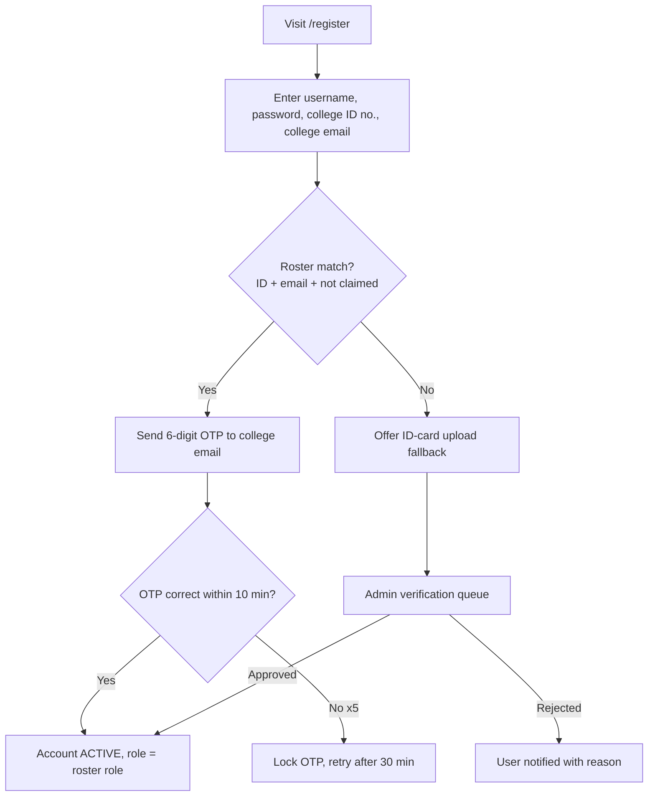
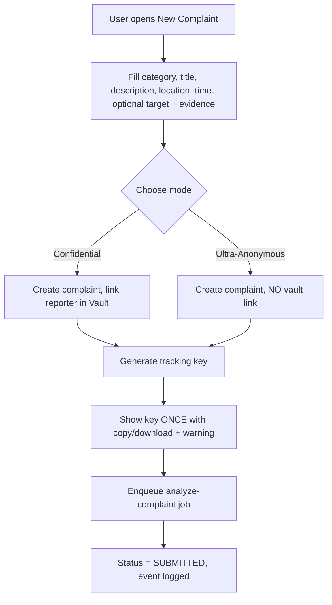
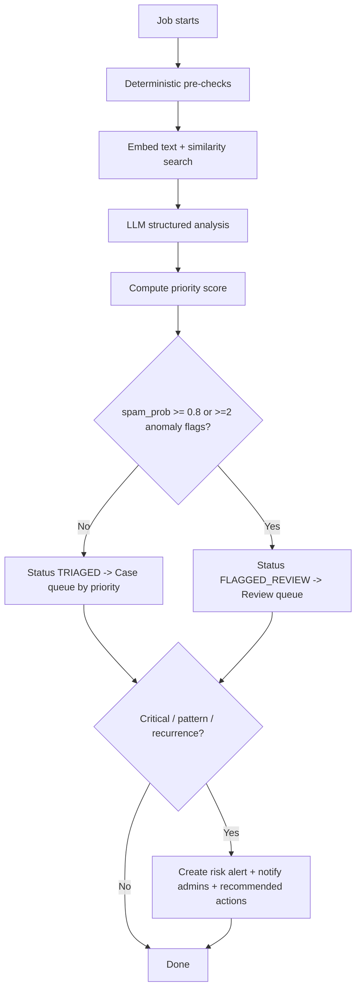
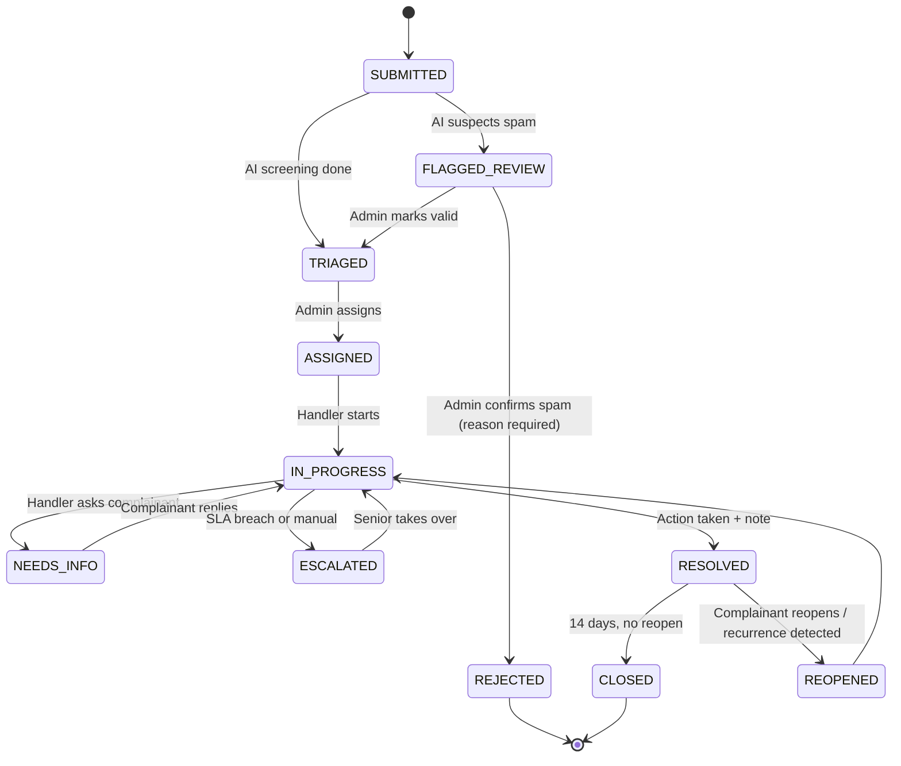
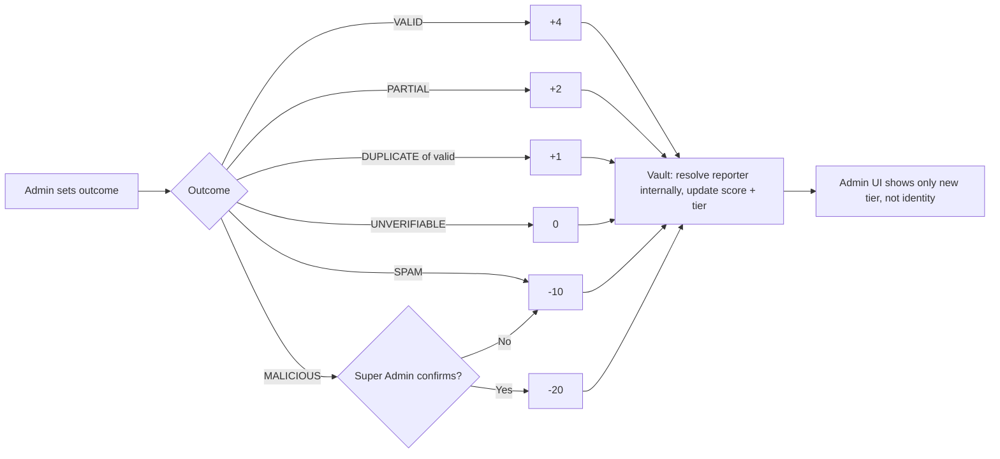
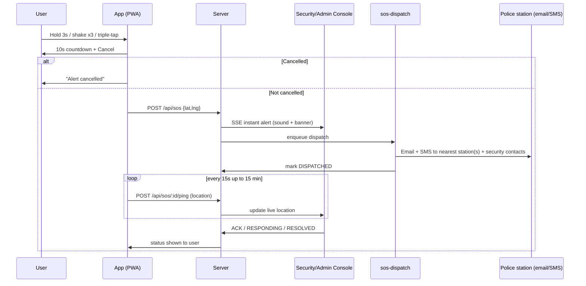

# CampusVoice — Workflows (v1.0)

> Companion to `PRD.md` and `ARCHITECTURE.md`. Section 9 describes the **build workflow** for Antigravity.

---

## 1. Registration & Verification

Rules: one roster identity ↔ one account; role comes from the **roster**, never from user input; unverified users can only read rules.

## 2. Complaint Submission

Optional before submit: AI "help me phrase this" and "check for identifying details" suggestions.

## 3. AI Screening & Triage (async)

## 4. Case Handling (Admin)

Required on each transition: actor role, timestamp, reason (for REJECTED / ESCALATED / RESOLVED), event written to timeline.

On RESOLVED/REJECTED the admin records an **Outcome**: `VALID`, `PARTIAL`, `DUPLICATE`, `UNVERIFIABLE`, `SPAM`, `MALICIOUS` (the last requires Super Admin). This outcome triggers the trust score update (§6).

## 5. Admin ↔ Complainant Chat

1. Admin opens case → writes message (shown as "Admin Office", not personal name, unless admin chooses to show name).
2. Complainant is notified (in-app; email if Confidential + opted in).
3. Complainant opens chat via **My Complaints** (Confidential) or **Track by key** (Ultra-Anonymous).
4. Status auto-toggles `NEEDS_INFO ↔ IN_PROGRESS` based on who replied last when the admin used "Request info".
5. Internal notes are separate and **never** visible to the complainant.
6. Warning banner in chat: "Avoid sharing details that could identify you if you want to remain anonymous."

## 6. Trust Score Update

Skipped entirely if: Ultra-Anonymous mode, or complaint category is a safety category (harassment, ragging, threats, discrimination).

## 7. SLA & Escalation

| Priority | First response | Resolution target | On breach |
|---|---|---|---|
| CRITICAL | 2 h | 24 h | Alert all admins + Super Admin, SMS/email |
| HIGH | 24 h | 3 days | Alert assigned admin + Super Admin |
| MEDIUM | 72 h | 10 days | Mark ESCALATED, notify admin |
| LOW | 7 days | 30 days | Show overdue badge |

`sla-escalation` job runs every 10 minutes, writes `SLA_BREACH` risk alerts and timeline events.

## 8. Repeat Detection & Timeline

1. New complaint embedded → compared with last 90 days.
2. Similarity ≥ threshold **and** same category/location → join or create `cluster`.
3. If the cluster has a RESOLVED case older than the new complaint → `RECURRENCE` alert ("Issue reappeared after being marked resolved").
4. Nightly `recurrence-scan`: any target entity with ≥ 3 complaints in 30 days → `PATTERN` alert.
5. **Cluster timeline** (admin view) shows a single chronological list: each complaint date, actions taken (status changes, notes), and a highlighted "No action taken in X days" gap.
6. Complainant timeline shows only their own complaint's events (never other people's).

## 9. SOS Flow

Failure path: delivery fails → retry with backoff → if still failing, show red banner to admins and tell the user to call 112.

## 10. Rules Assistant Flow

1. Super Admin publishes/edits a rule → `embed-rules` job re-chunks and embeds.
2. User asks: "Can a professor take my phone during class?"
3. System retrieves top-5 rule chunks → LLM answers **only** from them with citations.
4. If no relevant chunks: "I couldn't find a rule on this" + button **File a complaint** (pre-fills category/description).
5. If crisis language detected: show support message + SOS shortcut at top.

## 11. Break-Glass Identity Reveal

1. Super Admin A requests reveal for Complaint X with written reason (threat / legal order / proven malicious).
2. Super Admin B (different person) reviews the reason and approves or denies.
3. On approval: identity shown once, audit log entry created, both admins recorded; reporter is **not** notified (to avoid retaliation risk) but a quarterly anonymized count is published in the transparency report.
4. Not available for Ultra-Anonymous complaints.

---

## 12. BUILD WORKFLOW (for Antigravity)

**How to run it:** put all four docs in the repo root, open the folder in Antigravity, use **Planning mode**, paste the master prompt from `ANTIGRAVITY_PROMPT.md`, review the plan artifact, then run one phase at a time.

| Phase | Deliverables | Definition of Done |
|---|---|---|
| **0 Scaffold** | Next.js + TS + Tailwind + shadcn, Prisma, docker-compose (pgvector, mailpit), lint/test setup, `.env.example`, seed script | `docker compose up` + `npm run dev` shows home page; `npm test` passes |
| **1 Auth & RBAC** | Roster import (CSV), register, OTP verify, login, sessions, role middleware, ID-card queue | e2e: register→OTP→login; RBAC matrix unit tests green |
| **2 Complaints core** | Form, categories, locations, tracking key, vault link/ultra-anon, timeline, My Complaints, Track page | e2e: submit→key→track; DB test proves `complaints` has no user link; vault isolation test |
| **3 Admin console + chat** | Dashboard, case list/detail, statuses, notes, outcomes, chat (SSE), internal notes | Admin can run case end-to-end; complainant sees replies |
| **4 Rules + AI assistant** | Rules CRUD + versioning, chunk/embed job, RAG chat with citations, guardrails | Eval: answers cite rules; unknown question returns "not found" |
| **5 AI analysis** | Pipeline job, spam/anomaly, priority, clusters, recurrence/pattern, risk alerts, trust engine | Fixture evals pass; no auto-penalty; alerts visible |
| **6 SOS** | Triggers, countdown, API, dispatch job (email+SMS mocks), security console, pings | e2e with mocked providers; dispatch < 15 s in test |
| **7 Analytics & notifications** | Charts, heatmap by location, notification center, SLA job, transparency stats | Dashboards render with seeded data |
| **8 Hardening & deploy** | Security checklist, rate limits, headers, audit logs, backups doc, deploy guide | Checklist in ARCHITECTURE §11 fully ticked; e2e suite green |

**Rules for every phase:** (1) write/update tests first or alongside, (2) run lint + typecheck + tests, (3) verify UI in the browser and capture screenshots as artifacts, (4) summarize what changed and any deviations from the docs, (5) stop and wait for approval before the next phase.
